Guide for Users Authentication App Build
========================================
Github Repository: [RAWcode User Authentication REPO](https://github.com/RAWdevX21/rawcode-user-authentication)

---

Table of Contents
-----------------

- [Guide for Users Authentication App Build](#guide-for-users-authentication-app-build)
  - [Table of Contents](#table-of-contents)
  - [Chapter I](#chapter-i)
    - [Create project](#create-project)
    - [Install dependencies](#install-dependencies)
    - [Create _Sendgrid API Key_](#create-sendgrid-api-key)
    - [Setup (_.env_)ironment variables](#setup-environment-variables)
    - [Setup `start` and `dev` scripts using `esm`](#setup-start-and-dev-scripts-using-esm)
    - [Clean code](#clean-code)
    - [Create Github Repository](#create-github-repository)
    - [Project structure](#project-structure)
  - [Chapter II](#chapter-ii)
    - [Express server and database connection](#express-server-and-database-connection)
    - [User model and schema methods](#user-model-and-schema-methods)
    - [User API setup](#user-api-setup)

---
Chapter I
---------
In this part, we are going to set-up create a simple node express application from scratch keeping in mind to integrate the following features:
- Secure User Authentication via Jsonwebtoken
- Secure User Verification via Email
- Secure Password Reset via Email
- MongoDB native methods and Hooks
- Integration of Sendgrid Emailing service

### Create project

1. Begin by creating a directory for the application.
   ```sh
   mkdir auth-app && cd auth-app
   ```
2. Create a /src folder
   ```sh
   mkdir src && touch src/app.js
   ```
3. Create a ***package.json*** with **npm**, _node package manager_
   ```sh
   npm init
   ```
   <blockquote>
   <sub><strong>You will be prompted the following:</strong></sub>
   <br><br>
   package name: (auth-app) <code>| hit <strong>enter</strong></code><br>
   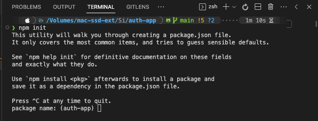<br>
   version: (1.0.0)  <code>| hit <strong>enter</strong></code><br>
   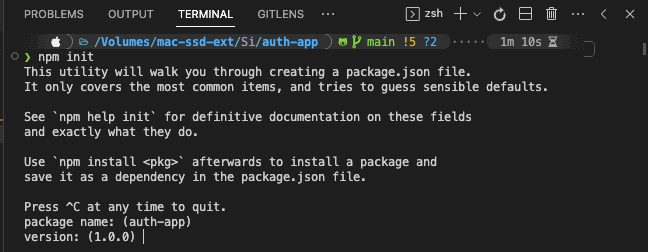<br>
   description:  <code>| type <strong>Complete user authentication, verify, reset password engine</strong></code><br>
   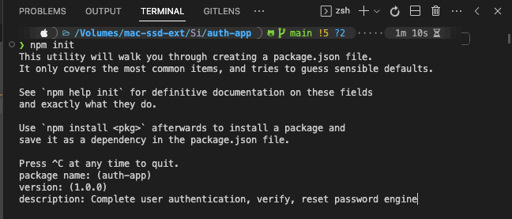<br>
   entry-point: (index.js) <code>| type <strong>src/app.js</strong></code><br>
   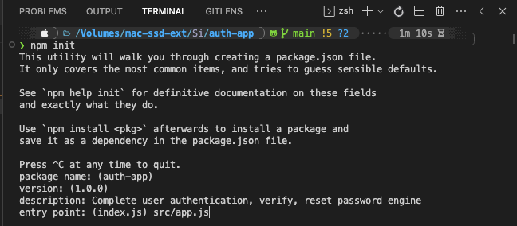<br>
   test command: <code>| hit <strong>enter</strong></code><br>
   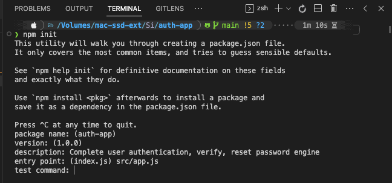<br>
   git-repository: <code>| hit <strong>enter</strong></code><br>
   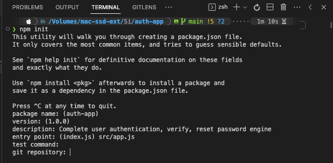<br>
   keywords: <code>| hit <strong>enter</strong></code><br>
   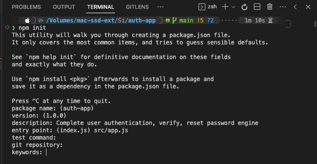<br>
   author: <code>| type <strong>< your-name></strong></code><br>
   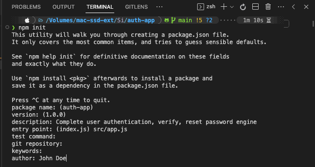<br> 
   license:<code>| type <strong>MIT</strong></code><br>
   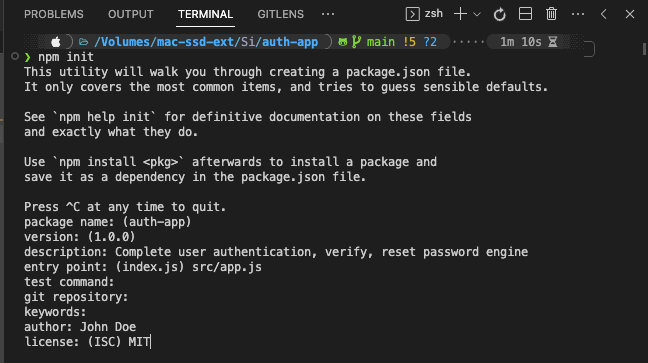<br>
    Is this OK? (yes) <code>| hit <strong>enter</strong> or type <strong>y</strong></code><br>

   </blockquote>
### Install dependencies

Required dependencies is as follow:
* [express](https://www.npmjs.com/package/express)
* [mongoose](https://www.npmjs.com/package/mongoose)
* [body-parser](https://www.npmjs.com/package/body-parser)
* [cors](https://www.npmjs.com/package/cors)
* [consola](https://www.npmjs.com/package/consola)
* [jsonwebtoken](https://www.npmjs.com/package/jsonwebtokens)
* [passport](https://www.npmjs.com/package/passport)
* [passport-jwt](https://www.npmjs.com/package/passport-jwt)
* [bcryptjs](https://www.npmjs.com/package/bcryptjs)
* [dotenv](https://www.npmjs.com/package/dotenv)
* [esm](https://www.npmjs.com/package/esm)
* [express-validator](https://www.npmjs.com/package/express-validator)

4. Install the required dependencies
   ```sh
   npm i express mongoose body-parser cors consola jsonwebtoken passport passport-jwt bcryptjs dotenv esm express-validator
   ```
5. Install ***nodemon*** globally
   ```sh
   sudo npm i -g nodemon
   ```
   <sup>✪ you will be prompted to enter your system password</sup>
6. Open "Visual Studio Code" editor
   ```sh
   code .
   ```

### Create _Sendgrid API Key_

<sub>For this part, you need an account with [Sengrid.com](https://app.sendgrid.com/), if not then create a free account</sub>

7. Open your browser, log into your Sendgrid account
8. Go to `Settings` and click `API Keys`
9. In the next page, top right corner, click `Create API Key`
10. At the top of the next page, create an `#API Key Name`
11. Select `Restricted Access` option
    8.1 Under `API Keys` tap the `Full Access` button scale
    8.2 Repeat for `Mail Send` only, not "Scheduled Sends"
    8.3 Then click `Create & View` submit button
12. `Copy` your new API Key, save it somewhere safe, and click `Done`

<sub>Return back to your VS Code editor.</sub>

### Setup (_.env_)ironment variables

<sub>In your ***auth-app*** root directory...</sub>

13. Create two files: ***.env*** and ***.env.example***
    ```sh
    touch .env .env.example
    ```
14. Open the **.env** file, append the following, and ***save***:
    <blockquote>
    APP_SENDGRID_API= < your_API_Key >
    <br>
    APP_DB=mongodb://localhost:27017/auth-app
    <br>
    APP_DOMAIN=http://localhost:5500/
    <br>
    APP_SECRET=1234567890
    <br>
    APP_PORT=5500
    </blockquote>
    <sup>✪ Make sure to replace < your_API_Key> with the new API Key from <a href="https://app.sendgrid.com/settings/api_keys">Sendgrid</a>.</sup>

15. Open the **.env.example** file, append the following, and ***save***:
    <blockquote>
    APP_SENDGRID_API=
    <br>
    APP_DB=
    <br>
    APP_DOMAIN=
    <br>
    APP_SECRET=
    <br>
    APP_PORT=
    </blockquote>

### Setup `start` and `dev` scripts using `esm`
   <sup>
   Go into your <strong><em>package.json</em></strong> file...
   </sup>

16. Edit _"scripts"_, _"author"_, and _"license"_ to look similar to the following:
    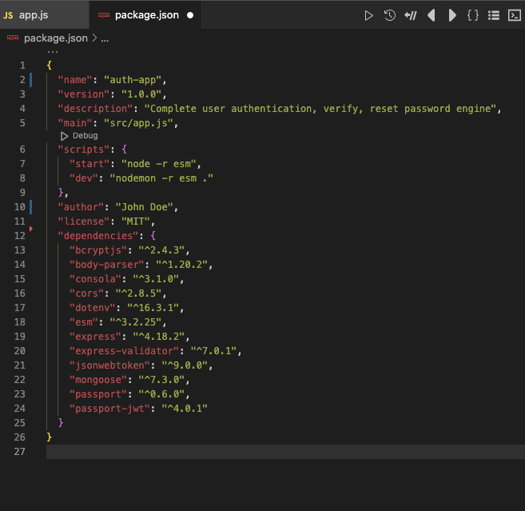
    <br>
    <sub><strong><em>☆ Lets test the code to make sure it's running properly</strong></em></sub>
17. Go to your ***src/*** folder and open **app.js**
    <br>
    <sub><strong><em>Type the following into app.js and SAVE</em></strong></sub>
    ```javascript
    const inform = console.log;

    inform("HELLO WORLD!");

    // Be sure to save your work!
    ```
18. Open your terminal and navigate to the directory of this app
    <br>
    <sub><strong><em>Run the following command in the terminal</em></strong></sub>
    ```sh
    npm run dev
    ```
    <br>
    <sub><strong><em>It should look something similar to the following:</em></strong></sub>
    <br>
    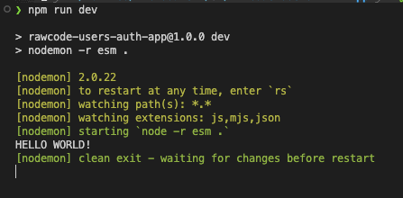
    ```sh
    # press ^C [ctrl + c] to exit
    ```

### Clean code

Following a structure inside a project gives a clear idea how the application is working. Lets create a clean project structure.

19. First, lets initialize an empty _Git repository_ and create a _.gitignore_ file
    ```sh
    git init
    touch .gitignore
    ```
20. insert a list including `.history/`, `node_modules/`, and `.env` in the ***.gitignore*** file. It should look something similar to the following:
   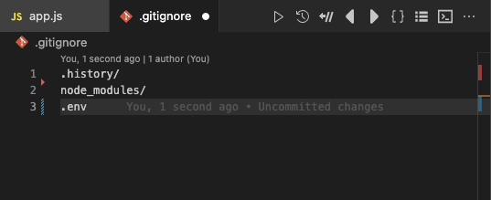
   <br>
   
   ***SAVE*** your work!

### Create Github Repository

21. Go to your [Github Account](https://github.com/), open **Repositories**, and click **`New`**
22. Select your _username_ under the field "Owner" and _name your project_ under "Repository name"
23. Proceed with **`Create Repository`**
24. Return to the terminal, and run the following commands:
    ```sh
    git add .
    git status
    git commit -m "initial commit, clean project structure"
    git branch -M main
    git remote add origin https://github.com/<your-username>/auth-app.git
    git push -u origin main
    ```

### Project structure

25.  Create the following folders in the ***/src*** directory:
      * apis
      * constants
      * functions
      * middlewares
      * models
      * validators
     ```sh
     mkdir src/apis src/constants src/functions src/middlewares src/models src/validators
     ```

Chapter II
----------
In this part, we are going to create a User Model and also we will add mongoose methods to the UserSchema and mongoose hooks, with features like.

- Function to generate Password Reset Token
- Function to issue a JSON web token authentication Token
- Function to serialize user data with lodash library
- User Registration input validation using Express-Validator Package

### Express server and database connection

1. Proceed to the **src/** directory and open the ***app.js*** file.
2. Setup **`runApp()`** function and import _**express** server_ and needed libraries. 
   <blockquote>
   <sub><em>Import the following dependencies:</em></sub><br>

   ```javascript
   import cors from "cors";
   // useful for logging whatever we need
   import consola from "consola";
   import express from "express";
   //connect with the database
   import mongoose from "mongoose";
   import {json} from "body-parser";

   // Initialize express application
   const app = express();

   const runApp = () => {
      //in case of an error starting server
      try {
         // Connect with the database
         // Start application listening for request on server
      } catch (err) {}
   };

   runApp();
   ```
   </blockquote><br>

3. Pull in app constants from ***.env*** file
   <blockquote>
   <sub><em>create a <strong>config.js</strong> file in the <strong>./src/constants/</strong> directory.</em></sub>

   ```sh
      touch src/constants/config.js
   ```
   <sub>proceed to click open the <em>./src/constants/ <strong>config.js</strong></em> file & add the following:</sub>
   ```javascript
      import { config } from "dotenv";

      config();
      
      //export constant 1-by-1 from .env
      //gives access to the variables inside of process object
      export const DB = process.env.APP_DB;
      export const SECRET = process.env.APP_SECRET;
      export const DOMAIN = process.env.APP_DOMAIN;
      export const SENDGRID_API = process.env.APP_SENDGRID_API;
      export const PORT = process.env.PORT || process.env.APP_PORT;
   ```
   </blockquote> 

   Now we can receive the _`constants`_ inside the **app.js** file. 
   <br>

4. Import application **`constants`** and connect the database.

   ```javascript
   // Import Application Constants
   import { DB, PORT } from "./constants/config.js";
   // Initialize express application
   const app = express();

   //takes time for db to connect so make async and await the connect
   const runApp = async () => {
      try {
         // Connect with the database
         await mongoose.connect(DB, {
            useNewUrlParser: true,
            useFindAndModify: false,
            useUnifiedTopology: true,
         });

         // when it connects to DB then "Success" message
         consola.success("DATABASE CONNECTED...");
         // Start application listening for request on server
         // once we pass the PORT, it will give a callback
         app.listen(PORT, () => consola.success(`Server started on port ${PORT}`));
      } catch (err) {
         consola.error(`Unable to start the server \n${err.message}`);
      }
   };

   runApp();
   ```
   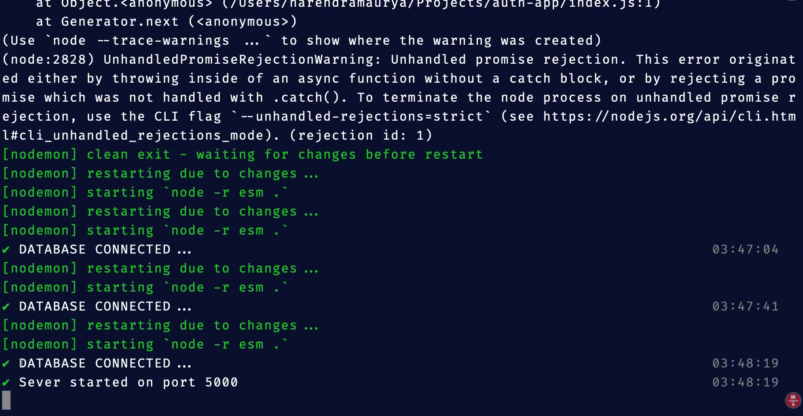
   <br>

5. Apply application ***`middlewares`***

   ```javascript
   
   // Apply application middlewares
   app.use(cors());
   app.use(json());

   const runApp = async () => {
      try {
         await mongoose.connect(DB, {
            useNewUrlParser: true,
            useFindAndModify: false,
            useUnifiedTopology: true,
         });

         consola.success("DATABASE CONNECTED...");
         app.listen(PORT, () => consola.success(`Server started on port ${PORT}`));
      } catch (err) {
         consola.error(`Unable to start the server \n${err.message}`);
      }
   };
   runApp();
   ```

   So far, we are now good with the **`runApp()`** function. We can close this window for now.

### User model and schema methods

Lets define the _**User** model_ for us.

6. Create two files in the ***models/*** directory.
   ```sh
   touch src/models/index.js src/models/users.js
   ```


### User API setup


<blockquote></blockquote>
